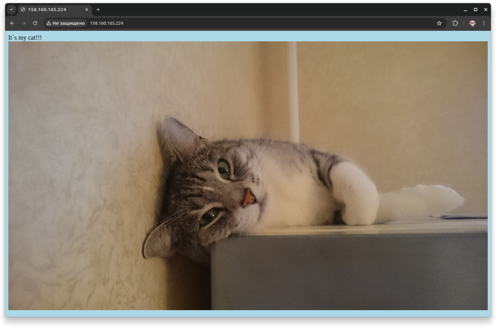
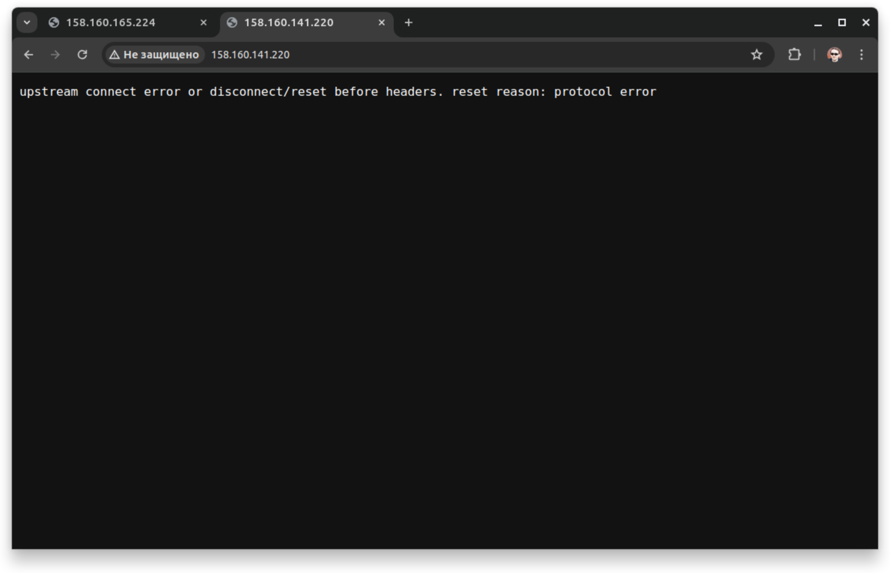
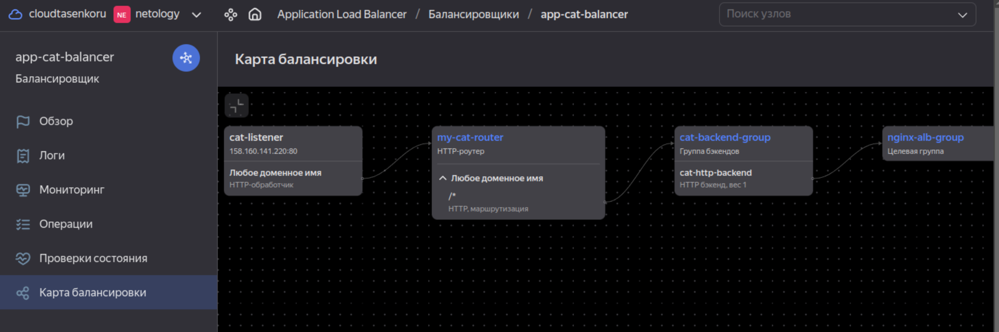

### Задание 1. Yandex Cloud  
1. Создать бакет Object Storage и разместить в нём файл с картинкой.  
- Бакет создается в файле [main-network-sa-bucket.tf](terraform/main-network-sa-bucket.tf) блоком yandex_storage_bucket.catpictures. Помимо бакета в том же файле создаются сервис-аккаунты, ключи и сеть с расчетом на следующие задания.  
- Картинка кладется в бакет там же блоком yandex_storage_object.fridgecat, параметр acl = "public-read" открывает публичный доступ.  
2. Создать группу ВМ в public подсети фиксированного размера с шаблоном LAMP и веб-страницей, содержащей ссылку на картинку из бакета.  
- Instance Group с тремя ВМ и шаблоном LEMP создаются в файле [main-lb.tf](terraform/main-lb.tf).  
- Параметр metadata.user-data берется из файла [cloud-init.yml](terraform/cloud-init.yml), там же веб-страница с котиком.  
- Проверка состояния ВМ настроена, работает. Группа автоматически восстанавливает число машин до указанного при отказе.  
3. Подключить группу к сетевому балансировщику.  
- Сетевой балансировщик создан в файле [main-lb.tf](terraform/main-lb.tf) блоком yandex_lb_network_load_balancer.lamp-lb-1. В настройках группы из предыдущего задания есть параметр load_balancer.target_group_name для указания целевой группы балансировщика.  
- Если открыть публичный адрес балансировщика в браузере, страница и котик в наличии. При удалении одной или двух машин всё продолжает работать, спустя некоторое время группа восстанавливает ВМ до 3:  
  
4. Создать Application Load Balancer с использованием Instance group и проверкой состояния.  
- Первое что я не сразу понял - нельзя назначить одной группе ВМ сразу и сетевой балансировщик и L7. Пришлось сделать отдельную группу в файле [main-alb.tf](terraform/main-alb.tf).  
- Отличие от первой группы - параметр application_load_balancer.target_group_name определяющий группу назначения для L7 балансировщика.  
- И тут случился совсем кощмар с балансировщиком. Никак не могу заставить его работать. Сразу, из коробки я получил вот такой ответ по внешнему IP:  
  
- Карта балансировки корректная, группы связались с роутером:  
  
- Пробовал пересоздавать с разными подсетями (Денис на вебинаре говорил что важный момент - наличие у балансировщика сетей во всех зонах доступности даже если в них нет ресурсов), назначать разные группы безопасности, всячески менять параметры роутера и других компонентов цепочки.  
- Если в роутере сменить действие на Virtual Host с маршрутизации на ответ и вставить какой-то текст, балансировщик начинает показывать то что ожидается, но это не то что мне нужно.  
- Создал еще одну машину с внешним адресом в той же сети, проверил с нее при помощи curl ответ машин из целевой группы. Все отвечают как надо, но не работает. Потратил на это уже часа 4, устал.
