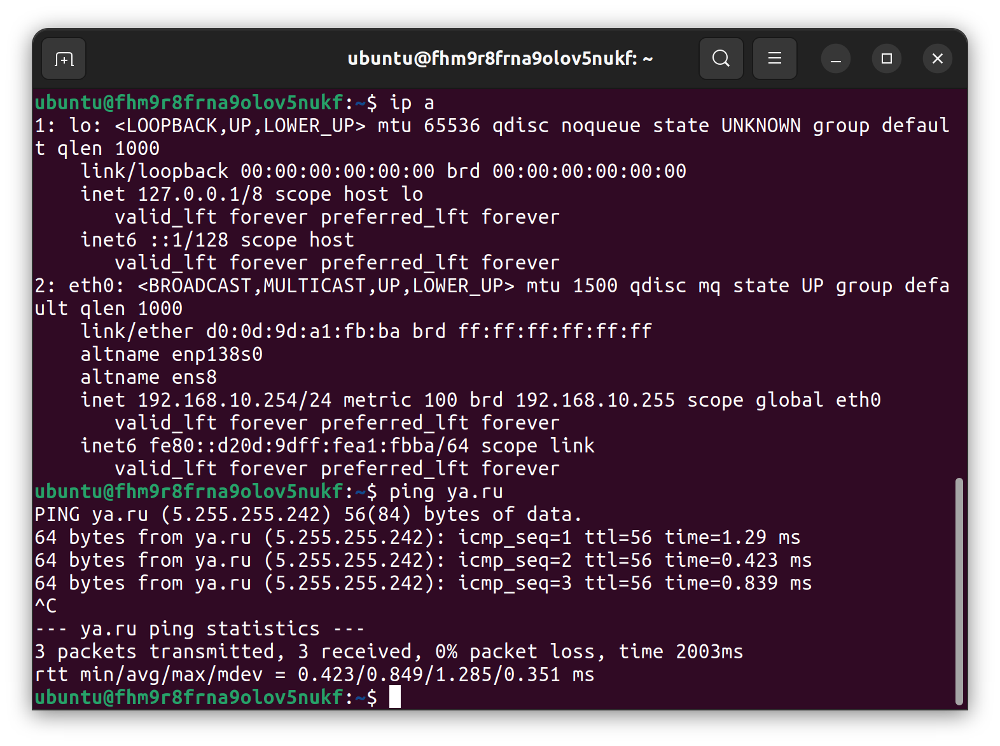
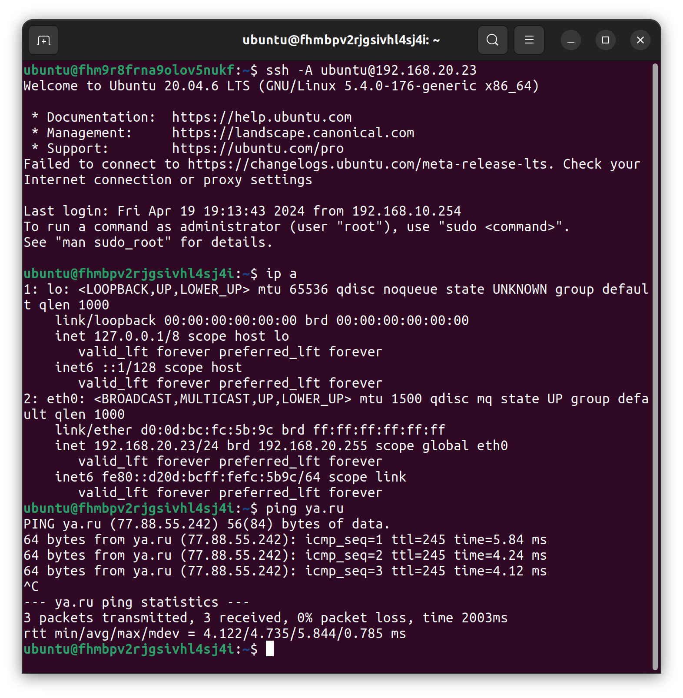

### Задание 1. Yandex Cloud  
1. Пустая VPC создается в файле [main.tf](terraform/main.tf) в блоке yandex_vpc_network.  
2. Публичная подсеть в том же файле, yandex_vpc_subnet.public.  
  - CIDR указан в переменной variable.public_cidr в файле [variables.tf](terraform/variables.tf).  
  - NAT-инстанс создан блоком yandex_compute_instance.public. IP адрес 192.168.10.254 захардкожен в параметрах, актуальный ID образа взят из Marketplace web-консоли.  
  - NAT-инстанс создан с публичным IP, у машины есть доступ в Интернет:  
  
3. Приватная подсеть создана блоком yandex_vpc_subnet.private. Зависит от следующего ресурса, yandex_vpc_route_table.private, иначе не получится привязать таблицу маршрутизации к подсети.   
  - Таблица маршрутизации со статическим маршрутом в том же файле, блок yandex_vpc_route_table.private. Зависит от yandex_compute_instance.public.  
  - Виртуальная машина yandex_compute_instance.private создана без публичного адреса, но благодаря таблице маршрутизации и машине с NAT есть доступ в Интернет:  
  
