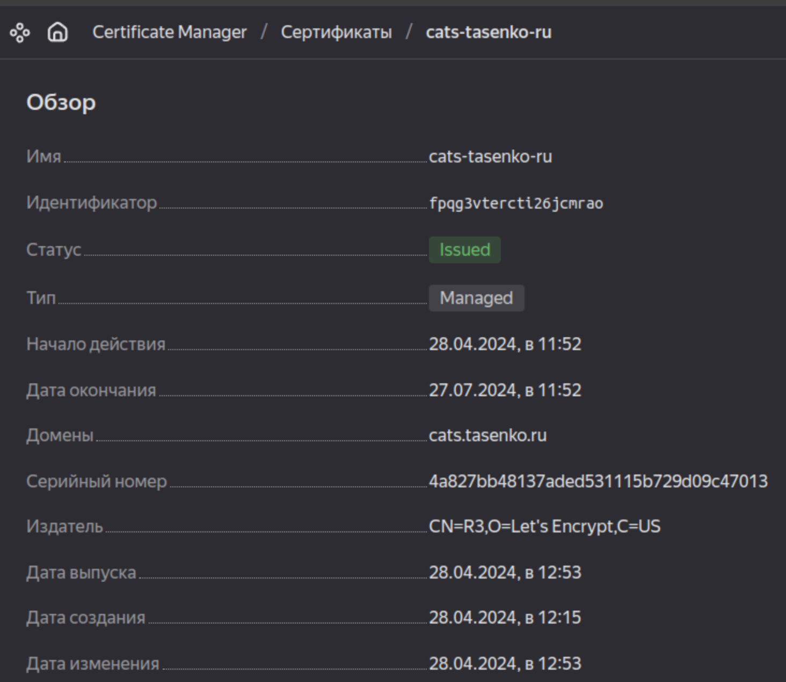

### Задание 1. Yandex Cloud  
1. С помощью ключа в KMS необходимо зашифровать содержимое бакета.  
- Для создания ключа в файл [main-network-sa-bucket.tf](terraform/main-network-sa-bucket.tf) дописал блок yandex_kms_symmetric_key.cat-key.  
- В конфигурацию бакета добавляю блок server_side_encryption_configuration, запускаю ```terraform apply``` и спустя пару минут параметры бакета в консоли меняются. Картинка с котиком продолжает работать в прежнем режиме.  
  
2. Создать статический сайт в Object Storage c собственным публичным адресом и сделать доступным по HTTPS.  
- Кажется, я понимаю почему в задании указано выполнять не в Terraform :)  
- Дописал дополнительные блоки в файл [main-network-sa-bucket.tf](terraform/main-network-sa-bucket.tf):
- yandex_cm_certificate.cats-tasenko-ru для получения сертификата. Просто чтоб не просматривать state и не ходить в консоль Yandex Cloud добавил [outputs.tf](terraform/outputs.tf) выводящий необходимые записи для подтверждения владения доменом.  
- website с указанием дефолтных страниц.  
- https в блок yandex_storage_bucket.catpictures где указал новый сертификат.  После запуска ```terraform apply``` получил запись, создал ее у хостера, в течение примерно часа сертификат сменил статус на Issued:  
  
- Добавил пару новых файлов для загрузки в бакет: [index.html](src/index.html) и [error.html](src/error.html), добавил блоки для их загрузки по аналогии с картнкой в предыдущей работе и началось...  
- Из терраформа эти файлы, если они не нулевого размера отказываются загружаться с ничего не говорящей ошибкой (на скриншоте уже проблема с картинкой, она после изменения бакета тоже перестала загружаться):  

- Кроме того, для корректной работы сертификата и CNAME записи вида cats.tasenko.ru -> cats.tasenko.ru.website.yandexcloud.net пришлось переименовать бакет. Об этом есть в документации, со старым именем получал еще и ошибку при переходе.  
- Удалил содержимое бакета, сам бакет и создал вручную из web-консоли. Получилось:  
- Сайт отвечает по адресу на домене yandexcloud.net, но с ошибкой сертификата, т.к. имя узла не соответствует.  

- По адресу [cats.tasenko.ru](http://cats.tasenko.ru) всё работает с валидным сертификатом.  

- Если открыть что-то чего на сайте не предусмотрено, например /api, получаем страницу ошибки.  

